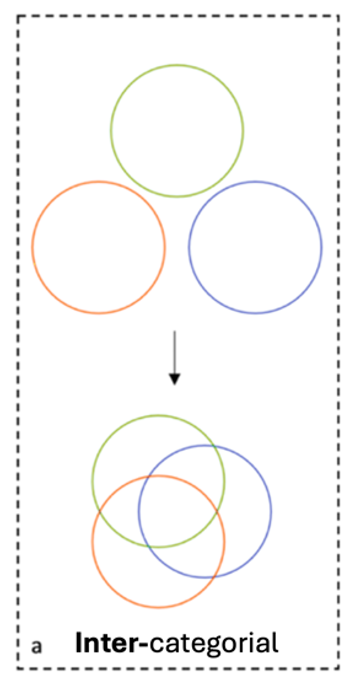
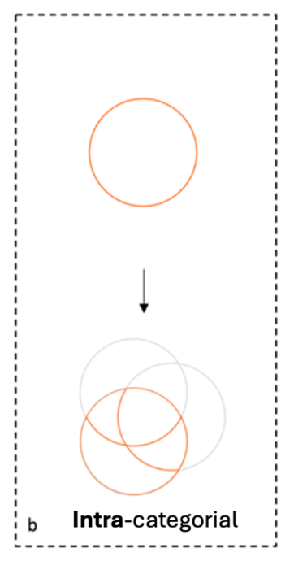
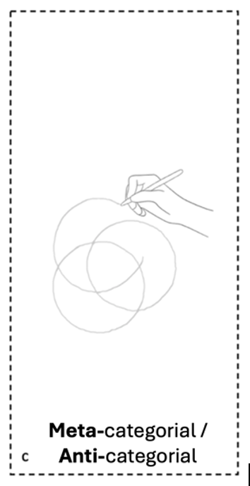
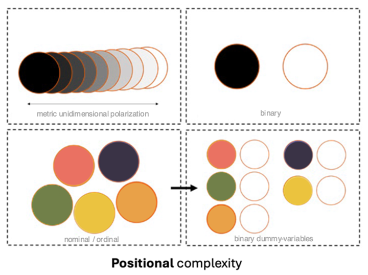
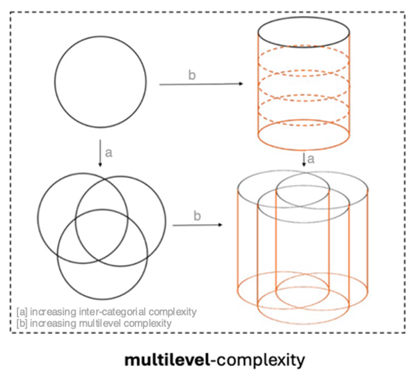

# Complexity

"Complex questions may require equally complex strategies for investigation."
Collins (2019, 47)

To capture the complex dynamics of power and inequality, intersectional research embraces multiperspectivity. Collins describes the combination of different methodological approaches as using different “lenses” (2019, 47), each sharpening some aspects of complexity while leaving others blurred. Intersectional methodological reflection should therefore not aim to seek a single method that can capture all dimensions of complexity at once (Cole 2009, 176), nor at establishing a normative hierarchy among them (Collins 2019, 250). Therefore, the <a href="guiding/">guiding</a> and <a href="methodological/">methodological</a>  questions on complexity encourage researchers to reflect systematically on the specific focus of a project.

I propose distinguishing five interdependent <u>dimensions of complexity</u>. The first three draw on Leslie McCall’s (2005) influential typology <a href="#fn1" id="ref1">1</a>: intercategorical, intracategorical, and anticategorical approaches. 

  

  

  

1.	The <u>intercategorical</u> approach increases complexity by adding more categories and their intersections. It offers a bird’s-eye view that reveals overarching patterns (McCall 2005, 1786pp).  
 
2.	The <u>intracategorical</u> approach focuses the heterogeneity within a social position (e.g. women) that emerges from intersections with other categories (e.g. race). It opposes homogenization and specifically draws attention to marginalized constellations of social positions that are often overlooked (e.g. Black Women) (McCall 2005, 1773, 1781). 
 
3.	<u>Anticategorical</u> approaches emphasize the fluidity and social construction of categories (McCall 1773; Else-Quest/Hyde 2016b, 328). They are closely connected to the idea of meta-categorical complexity which adopts a processual approach to categorization (Emmerich/Hormel 2013, 217). 
 
These can be expanded by two additional aspects: positional complexity and multilevel complexity.

  

  

4.	<u>Positional</u> complexity – focusing on the diversity and differentiation of social positions within one category (e.g. gender identity beyond the binary)<a href="#fn1" id="ref1">2</a>.   

 
5.	<u>Multilevel</u> complexity – acknowledging that intersecting processes operate across different societal levels <a href="#fn1" id="ref1">3</a>.  
 

A research project guided by the intersectional paradigm not only faces the complexity of its object of study and its analysis, but also the complexity of implementing intersectional praxis throughout the research process. Such an approach involves complex processes and designs, such as participatory elements, self-reflection, complex operationalization, or sampling strategies.

Given this background, the <a href="reflexive/">self-reflexive</a> questions on complexity in knowledge production support critical reflection on the individual and institutional responsibilities for enabling complexity within intersectional research processes.

Notes

<ol>

  <li id="fn1">
 McCall (2005, 1784) originally assigns typical methodological approaches to the dimensions of complexity - with quantitative methods being conceptualized as following an intercategorical approach. In contrast, this approach uses McCall's distinction as a heuristic tool to examine how all the different dimensions of complexity can be focused within quantitative intersectional approaches.
   <a href="#ref1">↩</a>
  </li>

  <li id="fn2">
    The associated methodological challenges are not unique to intersectional research but are already familiar from what Hancock (2007, 64) calls “unitary approaches”. However, they remain relevant and are amplified as complexity increases within intersectional analysis.
    <a href="#ref2">↩</a>
  </li>

  <li id="fn3">
    This dimension draws on theoretical work on intersectional multilevel analysis (e.g. Winker/Degele 2009) and is also consistent with Crenshaw's (1991, 1245) division into structural, political, and representational intersectionality or the domains of power (Collins/Bilge 2020, 248).
    <a href="#ref3">↩</a>
  </li>

</ol>

References

<ol>

  
 Collins, Patricia Hill (2019): Intersectionality as Critical Social Theory. Durham: Duke University Press. doi: 10.1215/9781478007098 
  
 Collins, Patricia Hill/Bilge, Sirma (2020): Intersectionality (Key Concepts). 2nd Edition. Cambridge: Polity. 
  
 Cole, Elizabeth R. (2009): Intersectionality and Research in Psychology. In: American Psychologist 64 (3), 170–180. doi: 10.1037/a0014564 
  
 Crenshaw, Kimberlé (1991): Mapping the Margins - Intersectionality, Identity Politics, and Violence against Women of Color. In: Stanford Law Review 43(6), 1241–1299. doi: 10.2307/1229039  
   
 Else-Quest, Nicole M./Hyde, Janet Shibley (2016b): Intersectionality in Quantitative Psychological Research: II. Methods and Techniques. In: Psychology of Women Quarterly 40 (3), 319–336. doi: 10.1177/0361684316647953 
  
 Emmerich, Marcus/Hormel, Ulrike (2013): Heterogenität – Diversity – Intersektionalität. Wiesbaden: Springer Fachmedien. doi: 10.1007/978-3-531-94209-4 
  
 Hancock, Ange-Marie (2007): When Multiplication Doesn’t Equal Quick Addition: Examining Intersectionality as a Research Paradigm. In: Perspectives on Politics 5(1), 63-79. doi: 10.1017/S1537592707070065 
  
 McCall, Leslie (2005): The Complexity of Intersectionality. In: Signs 30 (3), 1771–1800. doi: 10.1086/426800.  
  
 Winker, Gabriele/Degele, Nina (2009): Intersektionalität: Zur Analyse sozialer Ungleichheiten. Bielefeld: transcript Verlag. doi: 10.1515/9783839411490
 </li>
 

</ol>

Complexity

<a class="tab guiding" href="guiding/">Guiding Questions</a>

<a class="tab methodological" href="methodological/">Methodological Questions</a>

<a class="tab reflexive" href="reflexive/">Self-reflexive Questions</a>

