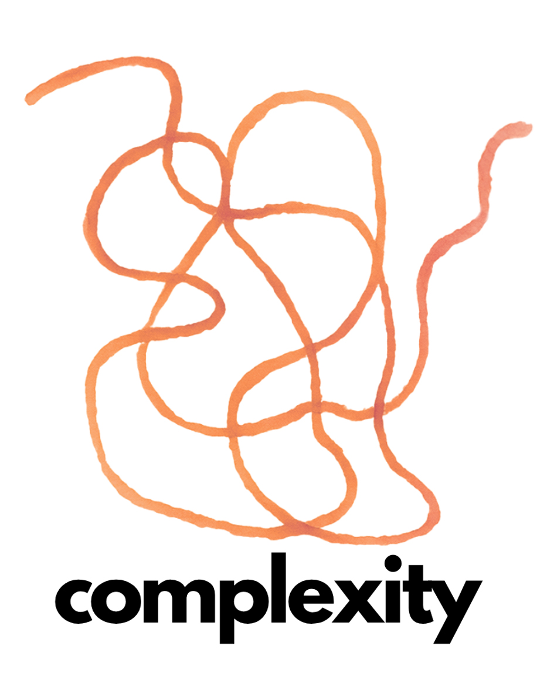
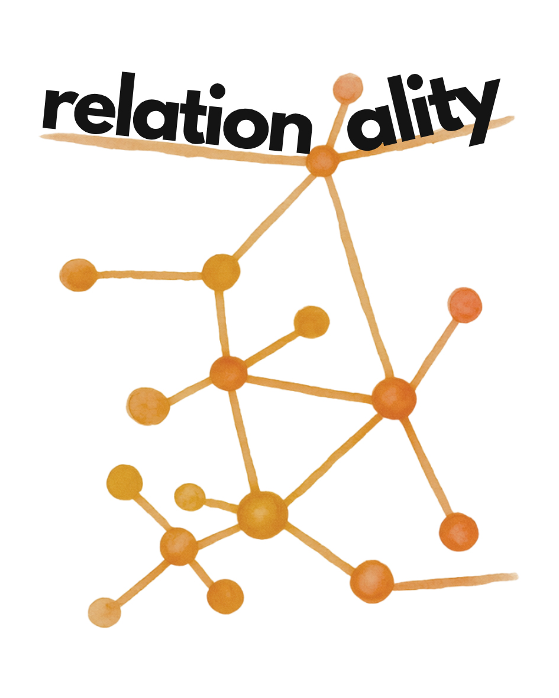
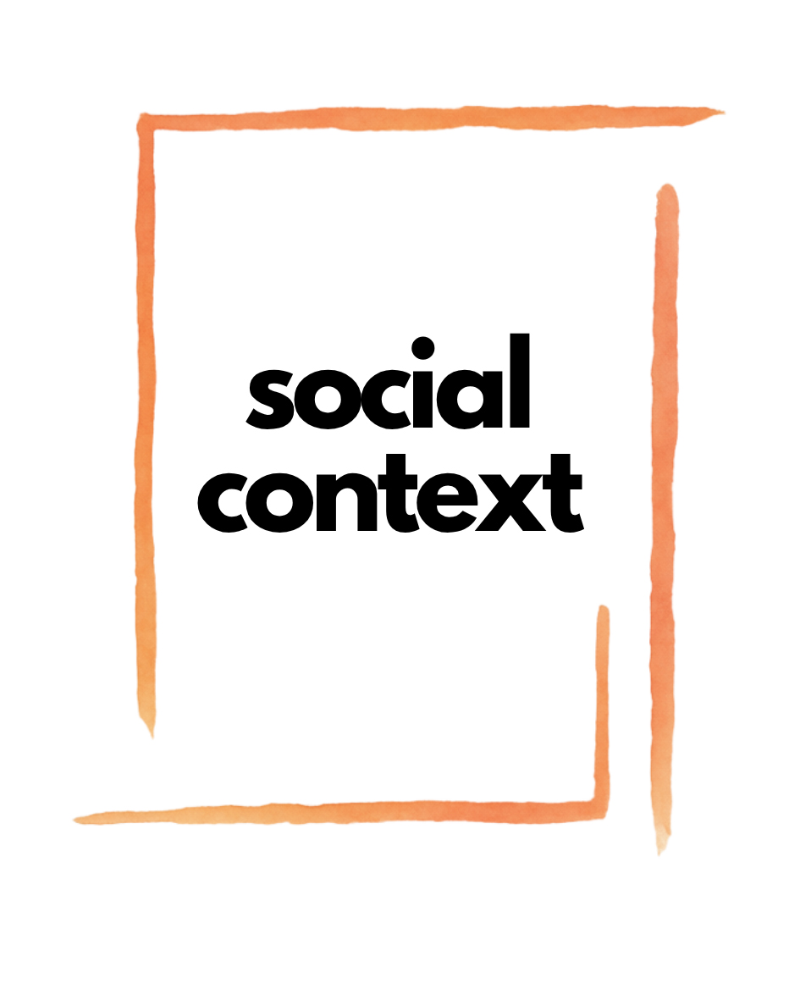
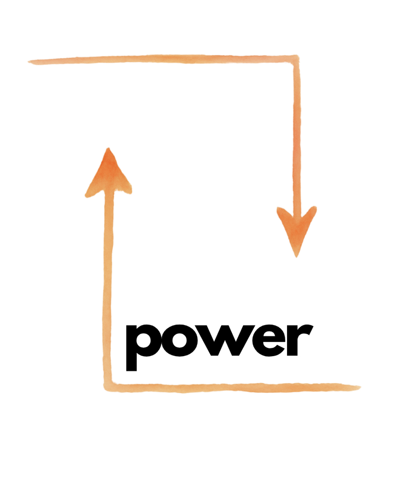
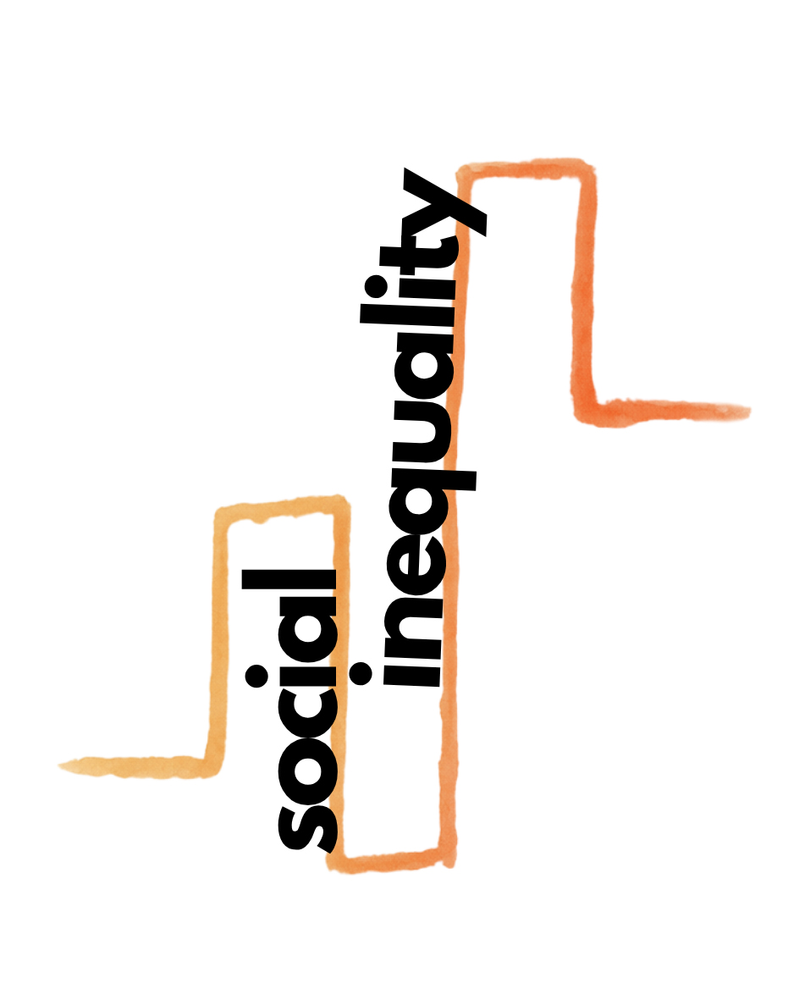
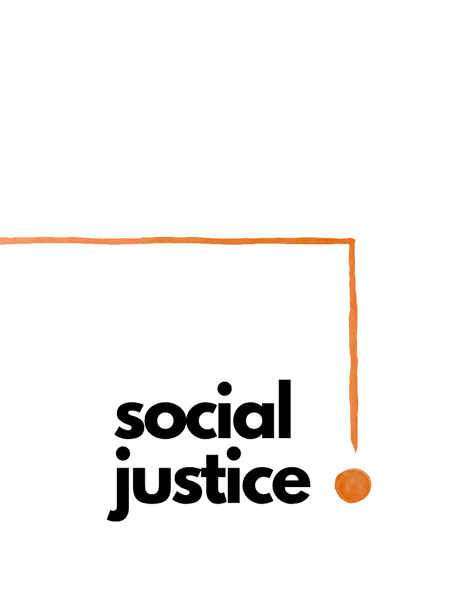

# Home

  

  

  

    
  

  

    
  

  

    
  

  

    
  

  

    
  

This conceptual tool is based on the framework developed by Patricia Hill Collins and Sirma Bilge (<a href="https://www.politybooks.com/bookdetail?book_slug=intersectionality-2nd-edition--9781509539673" target="_blank">Collins/Bilge 2020</a>; 
<a href="https://doi.org/10.1215/9781478007098" target="_blank"> Collins 2019</a>). It provides a set of guiding, methodological, and self-reflexive questions for each of the six core concepts of the intersectional paradigm. These questions can be used to critically assess existing (quantitative) intersectional analyses as well as to design future research projects, supporting theory-driven methodological decision-making throughout the research process. By incorporating a self-reflexive dimension, the tool also encourages critical engagement with positionalities, institutional conditions, and intersectional power relations in knowledge production. The tool aims to support a more theoretically grounded, critical, reflexive, and social justice–oriented approach to (quantitative) intersectional research. 
Brief introductions to each core concept and its role within the intersectional paradigm are provided in the corresponding notebooks throughout the tool. For a detailed discussion of the development of the framework, its theoretical foundations, and methodology see the accompanying paper: <a href="LINK_ZUM_PDF" target="_blank">Download paper</a>. 

---
